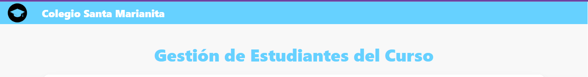
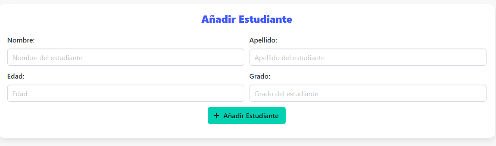
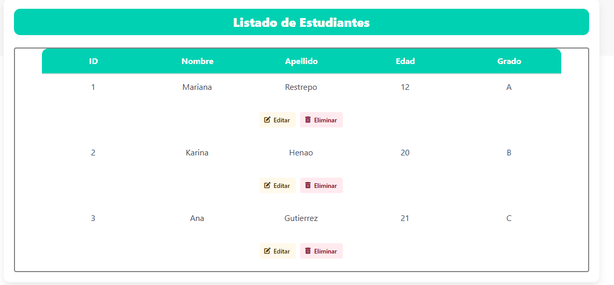
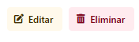
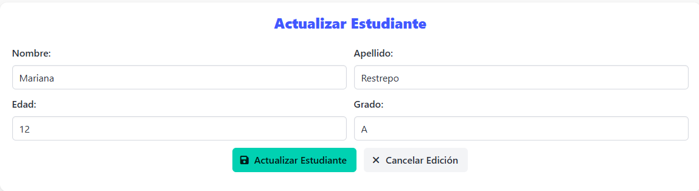

# Colegio Santa Marianita

Este proyecto es una página web sencilla y moderna para la gestión de estudiantes de un curso escolar.

Todo el flujo de la pagina dinámico: puedes agregar, actualizar o borrar estudiantes y ver los cambios reflejados al instante, sin recargar la página.

Al ingresar, encontrarás:

- Un formulario intuitivo para añadir nuevos estudiantes, donde puedes ingresar nombre, apellido, edad y grado.

- Un listado visual y ordenado de todos los estudiantes registrados, presentado en una grilla colorida y fácil de leer.

- Botones para editar o eliminar estudiantes de manera rápida y directa.

- Al dar click al boton de "Editar" se nos cambia el formulario de la parte superior para editar la información del estudiante.

- Un diseño limpio, responsivo y agradable, gracias al uso de Bulma y estilos personalizados.

---

¡Disfruta este proyecto hecho con mucho amor por Mariana Restrepo del clan Ritchie 💙!